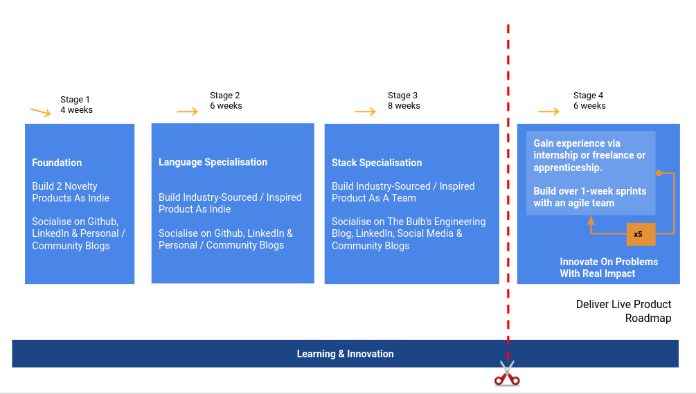

# Engineering Leadership Program - Curriculum

## Design

An engagement and productivity learning path for aspiring intemediate software engineers that consistently meet and exceed stakeholder expectations

## Desired Outcome

1.  Learning How To Learn (Get Ready For A Journey Of Life-long Learning)
    *   Growth mindset
    *   Asking questions
    *   Taking feedback
    *   Facing uncertainty &  ambiguity
    *   Recommended learning journey
    *   Finding answers online
    *   Using answers / resources from the internet

2.  Core Computer Science
    *   Understands data structures
    *   Understands & can implement optimised algorithms
    *   Understands the components of systems (system design) & can put one together. Understands design trade-offs

3.  Technical Depth & Expertise
    *   Builds with rigor, corrrectness, reliability, holistic thinking and overall quality 
    *   Communicates quality, depth, or technical debt
    *   Attains competence from experience
    *   Succeeds in a (remote-first) distributed agile team
    *   Has a portfolio of / socialises ~3 indie projects and >= 1 team project that clearly communicates usage, quality, and value
    *   Able to hit the ground running, and add value to a new team within the shortest possible time

4.  Product Delivery
    *   Understands the goals of the business & stakeholders
    *   Understands the goals of the product and can communicate it effectively
    *   Understands the needs and challenges of the user
    *   Empathizes with the user and optimises for them
    *   Builds iteratively, transparently, and with empathy

5.  Leadership
    *   Gives TASK feedback
    *   Understands, internalises, and socialises measures of success
    *   Demonstrates empathy, ownership & initiative, 
    *   Demonstrates accountability & integrity
    *   Effectively communicates & proactively manages stakeholders.

## Structure & Usage

The curriculum is spit into 4 main parts, called stages. Every stage builds into the next and the sequence is meant to be followed strictly. 

Each stage is hands-on, and is designed to empower engineers to demonstrate specific technical and professional expertise through engagements, projects, coaching, and feedback.

> The engagements and projects are broken down into technical and professional skills outputs, which can be submitted by the enginners or observed from them. The outputs are then scored to determine how aligned an engineer is to the desired expectation

## Program Structure

1.  [Stage - 1 : Foundation](./foundation.md)
2.  [Stage - 2 : Language Specialization](./lang-specialization.md)
3.  Stage - 3 : Stack Specialization
