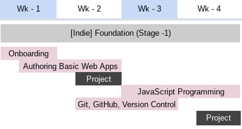

# Stage - 1: Foundation 

An engagement and productivity learning path for aspiring intemediate software engineers that consistently meet and exceed stakeholder expectations

> 4 Weeks
> Indie (supported by peers and facilitators)

**Pre-work**
---
*   Start thinking of your WHY
*   Learning how to learn
*   The internet
*   What the web can do
*   Finding information with search engines
*   How to get programming help online
*   How to use the command-line in MacOS/Linux and Windows
*   HTML & CSS crash course - you get to build something
---

## Modules

### Authoring Basic Web Apps
*   HTML & CSS
*   UI/UX Design Considerations(colors, typography, space, symetry, RWD)
*   Flexbox Layouts
*   Accessibility
*   Basic Javascript
*   **Build a simple stopwatch web app**

### Javscript Programming
*   The JS Language
*   OOP in Javascript
*   SOLID Principles
*   Modules
*   Code Style & Linting
*   Async JS. Fetch & Consuming APIs
*   **Build a simple persistent TODO list web app**

### Version Control

*   Basic Git / Github & Repos
*   Communicate with commit messages
*   Communicate with a README file
*   **Create a Github account. Add the Stopwatch and TODO apps**