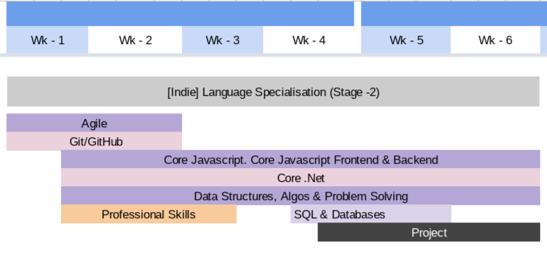
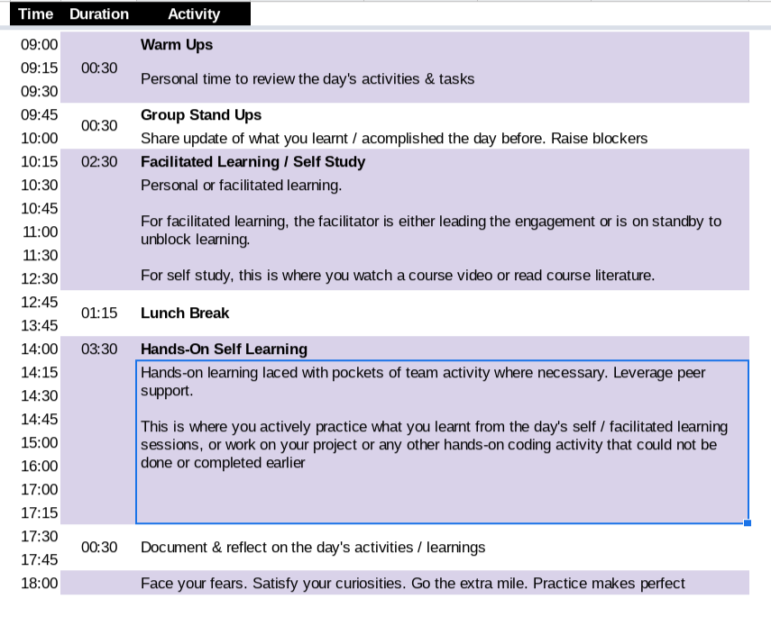

# Language Specialization

An engagement and productivity learning path for aspiring intemediate software engineers that consistently meet and exceed stakeholder expectations

> Delivery mode: Work as indie (supported in a learning group)
---
> Duration : 6 Week
---
> Learning Outcome: 
> 1. Fully grasp and articulate understanding of all key concepts of the programming language and stack of choice.
>  2. [Openly build](https://github.com/The-Bulb-Fellowship) and deploy a simple frontend or backend solution to a locally sourced problem
---
> Evaluation : Rated weekly knowledge checks and capstone project

  

#### Curriculum schedule

  

#### Suggested Daily Schedule

  

## Modules

### Professional Skills (all languages and stacks)

*   Receiving & Giving TASK Feedback
*   Asking for help
*   Share an article about your journey on your blog 
*   [Effective READMEs](https://www.makeareadme.com/) with [Markdown] https://www.youtube.com/watch?v=HUBNt18RFbo
*   Some [tips](https://blog.pitchme.co/2020/07/09/7-tips-improve-your-github/) to [improve your Github profile](https://towardsdatascience.com/build-a-stunning-readme-for-your-github-profile-9b80434fe5d7) with a [video demostration](https://www.youtube.com/watch?v=DOiGs2NiDbU)

### Computer Science & Architecture (all languages and stacks)

*   [Bits, Bytes](https://www.youtube.com/watch?v=u4P0LOofEFs) & [Data Units](https://www.youtube.com/watch?v=USCBCmwMCDA)
*   UDP, TCP, HTTP, FTP
*   [BigO Notation](https://www.youtube.com/watch?v=JgWm6sQwS_I). [Go deeper](https://www.youtube.com/watch?v=kS_gr2_-ws8)
*   [Data Structures Intro](https://www.youtube.com/watch?v=t2CEgPsws3U)
*   [Algorithms Intro](https://www.udacity.com/course/intro-to-algorithms--cs215)

### Agile & GitHub (all languages and stacks)
*   [A Beginner’s Git and GitHub](https://www.youtube.com/watch?v=SWYqp7iY_Tc)
*   [The agile methodology, principles & best practices](https://www.youtube.com/watch?v=xp5kbbEDPOE)
*   [Task management with Github (projects, issues, & milestones)](https://www.youtube.com/watch?v=idZyqNIrt84) 
*   Commits & README quality (workshop)
*   [Quality Code with GitHub and Codacy](https://resources.github.com/webcasts/GitHub-and-Codacy-thankyou/)

### Frontend (prioritised for Javascript)

> **Project** : build a web frontend for an industry sourced/inspired problem

*   [Close core HTML & CSS knowledge gaps](https://www.udacity.com/course/intro-to-html-and-css--ud001)
*   [Close core JS knowledge gaps](https://www.udacity.com/course/intro-to-javascript--ud803)
*   [ES6 & Modern Javascript](https://scrimba.com/learn/es6)
*   [Semantic HTML](https://www.pluralsight.com/courses/semantic-html-2329)
*   Responsive layouts with Flexbox
*   CSS Grid Intro
*   [CSS Animations Intro (opacity, transitions, transforms)](https://scrimba.com/playlist/pzKaBA7)
*   Web Performance Overview (DevTools, Core Web Vitals, Lighthouse)
*   Debugging, Unit Testing
*   Deploying to Netlify
*   NoSQL (Firebase)
*   React & Redux Foundation

### Backend (all languages and stacks)

> **Project** : build a REST API for an industry sourced/inspired problem

#### REST APIs

*   HTTP Codes & Response Data Types (Text, JSON, XML e.t.c)
*   Authentication & Authorisation
*   Validation & Security
*   Debugging, Unit Testing
*   API Versioning & Documentation
*   Design & Optimisation
*   Error Handling & Logging

#### Data & Databases (all languages and stacks)
*   Transient & Persistent Storage
*   [SQL Intro](https://www.youtube.com/watch?v=nWeW3sCmD2k)
*   [Relational Database Intro](https://www.udacity.com/course/intro-to-relational-databases--ud197)
*   PostgresSQL
*   Validation, Data Integrity, Security, SQL Injection
*   ACID, Transactions
*   Design & Optimisation (normalisation, indexes e.t.c)
*   NoSQL (MongoDB | Firebase)
